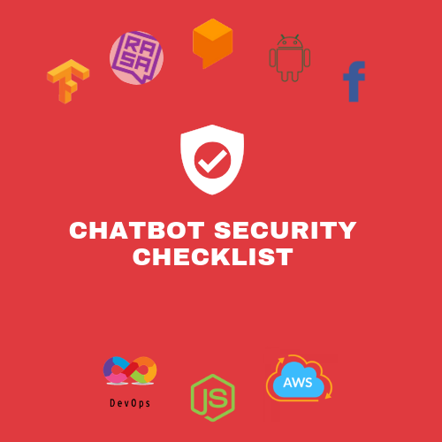

<h1 align="center">
<br>
  
  <br>
    <br>
  Chat-bot Security Checklist
  <br>
</h1>

<h4 align="center">The Chat-Bot Security Checklist is an exhaustive list of all elements you need to have before launching your chat-bot  to production.</h4>

<p align="center">
  <a href="http://makeapullrequest.com">
    
  </a>
    <a href="https://github.com">
    
  </a>
      <a href="https://github.com/">
    
</a>
    <a href="https://creativecommons.org/publicdomain/zero/1.0/">
    
  </a>
</p>

<p align="center">
  <a href="#how-to-use">How To Use</a> • <a href="#contributing">Contributing</a> • <a href="">Website</a> • <a href="https://www.producthunt.com/">Product Hunt</a>
</p>

It is based on Chat-bot developers' years of experience, with the additions coming from some other open-source checklists.

## Table of Contents

1. **[CLient Side Security](#Client-Security)**
    1. [OS Platform](#OS-Platforms)
    2. [Messaging Platforms](#Messaging-platforms)
    3. [Custom-Website Platform](#Custom-Web-Platform)
2. **[NLP Technology Secuirty](#NLP-security)**
    1. [Intent Classifiers](#Intent-Classifiers)
    2. [Dialog Mangement System](#Dialog-Management-System)
    3. [Conversation Records](#Conversation-Records)
3. **[Backend + Infrastructure](#Back-end-Infrastructure)**
    1. [OWASP Top 10](#OWASP-Top-10)
    2. [Licensing](#Licesnsing)

---

## How to use?

All items in the **Chat-bot Security Checklist** are must for majority of the projects.exception can only be made for regulatory reason. you can use this checklist to implement three layered defense your Chatbot product. I devided this security impact of each class in three Low, Medium, and High.

* ![Low][low_img] means that the item is **recommended** but can be omitted in some particular situations.
* ![Medium][medium_img] means that the item is **highly recommended** and can eventually be omitted in some really particular cases. Some elements, if omitted, can have bad repercussions.
* ![High][high_img] means that the item **can't be omitted** by any reason. You may leave a huge vulnerability open to the world. The testing priority needs to be on these elements first.


---

# Client-Security
When you are running your code in a machine you have no control, you need to take some measures to insure quite a few things

## OS-Platforms
* [ ] **Data:** ![High][high_img]Data is not accessible to other apps.
* [ ] **Authentication:**![High][high_img] You must you if your customer is using your platform.
* [ ] **Hardcoding:**![High][high_img] You are not storing your secrets on users device.

## Messaging-platforms
* [ ] **Authentication:**![High][high_img] You must you if your customer is using your platform.
* [ ] **regulatory Data Protection:**![High][high_img] You are not storing your secrets on users device.

## Custom-Web-Platform
* [ ] **Front-end Security**![High][high_img]
* [ ] **Authentication:**![High][high_img] You must you if your customer is using your platform.


# NLP-Security

## Intent-Classifiers
* [ ] **Intent Segregation:**![High][high_img] You must you if your customer is using your platform.

* [ ] **Permissioned Intent:**![High][high_img] You must you if your customer is using your platform.


## Dialog-Management-System
* [ ] **Authorization:**![High][high_img] You must you if your customer is using your platform.

* [ ] **Language generation Constraint:**![High][high_img] You must you if your customer is using your platform.

## Conversation-Records
* [ ] **Life Cycle Management:**![High][high_img] You must you if your customer is using your platform.
* [ ] **PII and PHI Redaction:**![High][high_img] You must you if your customer is using your platform.
* [ ] **Administration:** [High][high_img] You must you if your customer is using your platform.


# Back-end-Infrastructure

## OWASP-TOP-10
* [ ] **Injection:**
* [ ] **Broken Authentication:**
* [ ] **Sensitive data exposure:**
* [ ] **XML External Entities:**
* [ ] **Broken Access control:**
* [ ] **Security misconfigurations:**
* [ ] **Cross Site Scripting (XSS):**
* [ ] **Insecure Deserialization:**
* [ ] **vulnerabilities:**
* [ ] **Insufficient logging and monitoring:**

## Licensing
* [ ] **SLAs:** Check


---

## Chat-bot Security Checklist Badge

If you want to show you are following the rules of the Chat-Bot Checklist, put this badge on your README file!

➔ [](https://github.com/apoorvrajsaxena/Chat-Bot-Security-Checklist)

```md
[](https://github.com/apoorvrajsaxena/Chat-Bot-Security-Checklist)
```

**[⬆ back to top](#table-of-contents)**

---

## Contributing

**Open an issue or a pull request to suggest changes or additions.**

### Guide

The **Chat-Bot Security Checklist** repository consists of two branches:

#### 1. `master`

This branch consists of the `README.md` file.

#### 2. `develop`

This branch will be used to make some significant changes to the structure, content if needed. It is preferable to use the master branch to fix small errors or add a new item.

## Support

If you have any question or suggestion, don't hesitate to use Twitter:

* [Twitter](https://twitter.com/secxena)

## Author

**[Apoorv Raj Saxena](https://github.com/apoorvrajsaxena)**

## Contributors

This project exists thanks to all the people who contribute. [[Contribute]](.github/CONTRIBUTING.md).
<a href="https://github.com/apoorvrajsaxena/Chat-Bot-Security-Checklist/graphs/contributors"></a>


## Backers

🙏 [[Become a backer](https://opencollective.com/Chat-Bot-Security-Checklist#backer)]


## Sponsors

Support this project by becoming a sponsor. Your logo will show up here with a link to your website. [[Become a sponsor](https://opencollective.com/Chat-Bot-Security-Checklist#sponsor)]

## License

[](https://creativecommons.org/publicdomain/zero/1.0/)

**[⬆ back to top](#table-of-contents)**

[low_img]: data/low.svg
[medium_img]: data/medium.svg
[high_img]: data/high.svg
